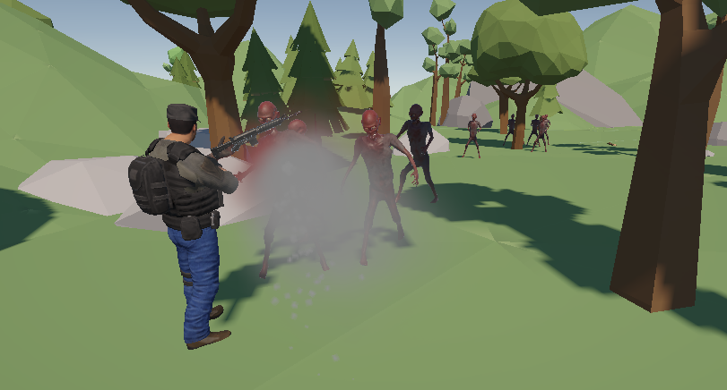
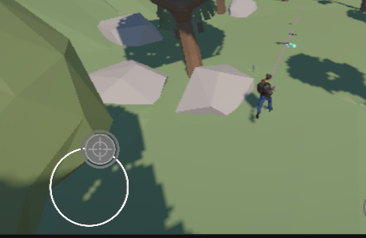
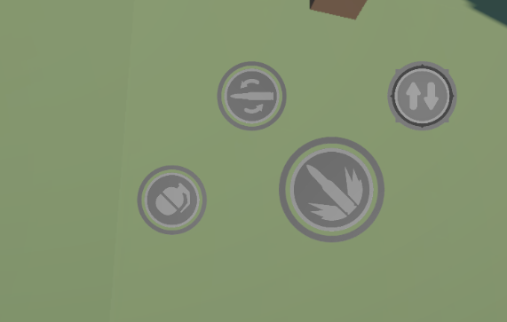
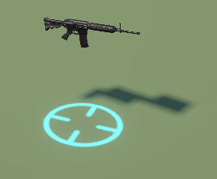
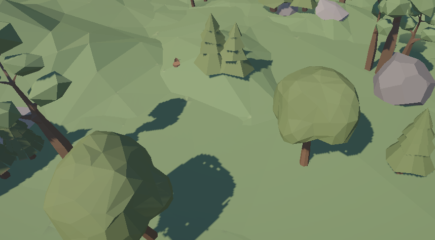
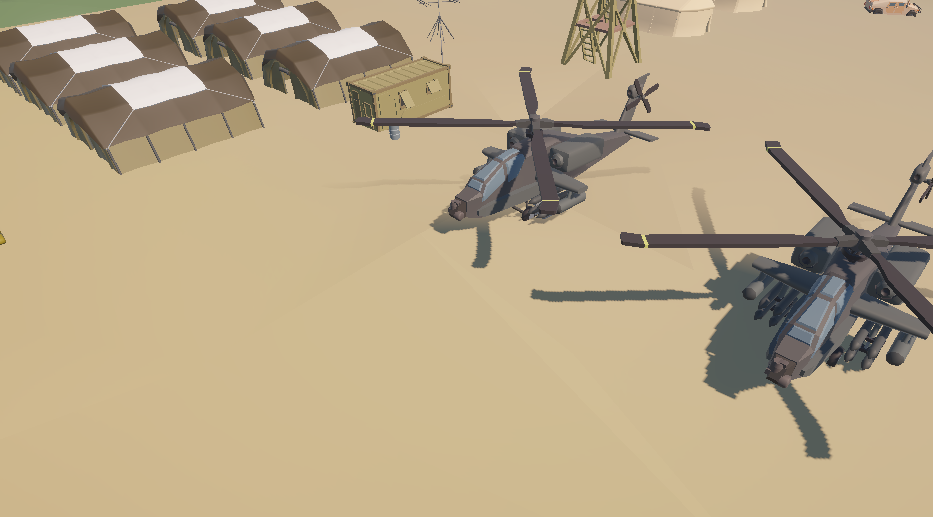
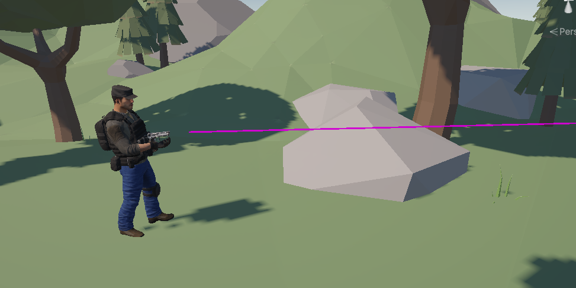

  

<h1 align="center">Zombie War — Top-Down Zombie Survival</h1>

  
  
  

---

## 👋 Giới thiệu

**Zombie War** là một game top-down action sinh tồn, nơi người chơi điều khiển một người lính chiến đấu xuyên qua khu vực đầy zombie để tới điểm đích. Dự án tập trung vào một combat loop dồn dập: chạy trốn — bắn — quăng bom, kết hợp hệ thống pooling và tối ưu hiệu năng để đảm bảo chạy mượt trên nhiều thiết bị Android.

Góc nhìn camera lấy trọng tâm góc nhìn từ top-down nghiêng của *Last Day on Earth*, theo sát nhân vật bằng Cinemachine.

---

## 🎮 Hướng dẫn Gameplay (Gameplay Tutorial)

Hệ thống hướng dẫn trong game được chia thành 4 trang trực quan giúp người chơi nhanh chóng làm quen với nhịp độ chiến đấu dồn dập của **Zombie War**.

---

### 1. Di chuyển bằng Virtual Joystick
Để sinh tồn trước bầy xác sống đông đảo, việc làm chủ hướng di chuyển là ưu tiên số một.

  
  

* **Cơ chế:** Sử dụng nút xoay ảo (**Virtual Joystick**) ở góc trái màn hình cảm ứng để điều khiển hướng chạy của nhân vật.
* **Mẹo sinh tồn:** Luôn di chuyển liên tục theo hình vòng tròn (kite quái) để tránh bị dồn vào góc chết hoặc bị bao vây bởi các Zombie tốc độ cao.

---

### 2. Nhặt Vật phẩm Tiếp tế (Loot Items)
Dọc đường đi, các hòm tiếp tế là nguồn cứu trợ sinh mạng cực kỳ quan trọng.

  

* **Cơ chế:** Bước vào **Vòng tròn phát sáng (Glow Indicator)** xung quanh vật phẩm rơi trên đất để tự động thu thập.
* **Các loại tiếp tế:**
  * **Hộp cứu thương (Medkit):** Hồi phục một lượng máu ngay lập tức.
  * **Thùng bom (Bomb):** Bổ sung thêm bomb để ném.
  * **Mở khóa súng:** Nhặt vũ khí mới (ví dụ: Rifle) để gia tăng hỏa lực và nạp lại đạn.

---

### 3. Kho Vũ khí Đa dạng (Multi-Weapon)
Linh hoạt thay đổi hỏa lực tùy theo tình huống đối đầu với từng loại Zombie.

  

* **Nút Switch (Đổi súng):** Nhấn để đổi qua lại giữa các vũ khí đã mở khóa.
* **Nút Bomb (Lựu đạn):** Ném một quả bom hẹn giờ gây sát thương diện rộng cực lớn (Splash Damage) dọn dẹp các cụm Zombie trong tích tắc.

---

### 4. Tiến tới Đích đến (Reach Goal)
Mục tiêu cuối cùng là sống sót xuyên qua cả 3 khu vực nguy hiểm để tới điểm sơ tán.

  
  

* **Cơ chế:** Map theo hướng ngang, hãy cố sống sót và tìm kiếm **Khu vực doanh trại quân đội**.
* **Điều kiện chiến thắng:** Chạm vào điểm đích để kích hoạt trực thăng/xe cứu hộ di tản và hoàn thành màn chơi an toàn.

---
## ⚔️ Vũ khí & Trang bị

| Vũ khí | Cơ chế | Đặc điểm |
| :--- | :--- | :--- |
| **Pistol** | Raycast | Tốc độ bắn vừa phải, chính xác |
| **Rifle** | Raycast | Tốc độ bắn nhanh, phù hợp giao tranh liên tục |
| **Grenade** | Splash damage (OverlapSphere) | Gây sát thương diện rộng, giới hạn số lượng mang theo |

- **Hệ thống pooling:** zombie và hiệu ứng particle (muzzle flash, hit impact) đều được quản lý qua object pool trung tâm, giảm tối đa chi phí Instantiate/Destroy khi giao tranh liên tục.
- **Multi-weapon:** đổi súng bằng 1 nút bấm, tự động bỏ qua vũ khí chưa mở khóa.

---

## ⚙️ Cơ chế cốt lõi

### 🧟 Zombie AI
- Trạng thái Idle / Chase / Attack dựa trên khoảng cách tới người chơi (NavMeshAgent).
- Hiệu ứng dissolve shader phát khi zombie chết, sau đó tự động release về pool.

### 🎯 Combat
- Bắn theo raycast, có tracer hiển thị đường đạn thời gian thực (LineRenderer).
  

  

- Hiệu ứng trúng đạn khác nhau theo bề mặt (thịt / vật thể).

### 🗺️ Level Design
- Map chia trải dài cả khu vực, zombie spawn theo trigger khi người chơi tiến vào từng khu vực — tạo nhịp độ tăng dần thay vì dồn hết quái ngay từ đầu.
- Chạm điểm đích ở cuối khu vực 3 để chiến thắng.

### 🖥️ UI & Đa nền tảng
- HUD hiển thị máu, đạn, thời gian, có Pause menu với chỉnh âm lượng và chất lượng đồ họa.
- Hỗ trợ đa độ phân giải (Canvas Scaler) và Safe Area cho các thiết bị có notch/tai thỏ.

---

## 🚀 Cài đặt

### ⚙️ Quick Start
1. **Clone:** `git clone <đường-dẫn-repo-của-bạn>`
2. **Mở:** Unity 6.5 hoặc mới hơn.
3. **Chạy:** Load scene `Assets/Scenes/Menu.unity`.

### ⌨️ Điều khiển
- **Virtual Joystick:** Di chuyển nhân vật
- **Nút Fire:** Giữ để bắn liên tục
- **Nút Switch:** Đổi vũ khí
- **Nút Reload:** Nạp đạn
- **Nút Bomb:** Ném lựu đạn

---

## 👤 Liên hệ

**Lâm Nhật Huy** — Game Developer
* **LinkedIn:** [(https://www.linkedin.com/in/huy-l%C3%A2m-3405142a5/)]
* **Email:** [huylam275@gmail.com]

---

  Cảm ơn đã dành thời gian trải nghiệm Zombie War! 🧟‍♂️🔫

